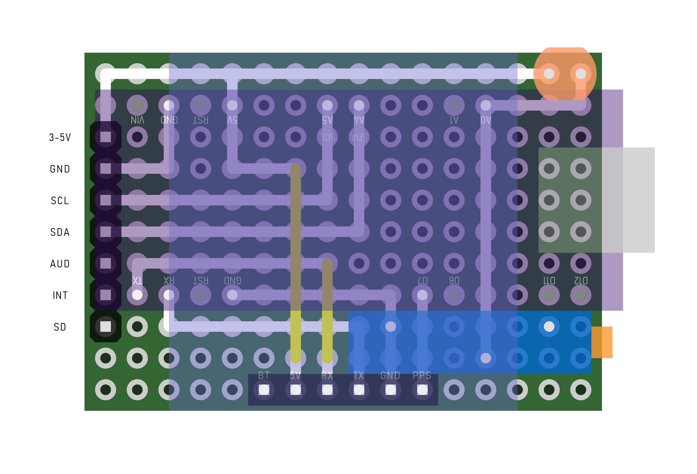

### Background

### Design

The first step was of course a proof of concept circuit. If I couldn't get the electronics and software working, there was little point in designing the rest of the unit. Thankfully this was pretty straight forward.

I initially chose the Seeeduino XIAO as the micro-controller for this project. At around 5 GBP a piece, They are absolutely tiny while offering plenty of IO and a quite powerful Arm Cortex M0+ chip. Most importantly, they use USB-C instead of the awful USB Micro connectors found on most Arduino-like boards.

I struggled to find an LED segment display that would match the interior dash lighting of the 370Z; but came close with the Adafruit Quad Alphanumeric Display in red. It wasn't quite the right style of display to match the matrix-like dashboard screens, but I figured I could try other displays once I had the GPS functionality working and this would make a nice test bed.

A simple LDR provides basic ambient light awareness for the controller, allowing it to dim the LED output when driving at night.

Unfortunately testing the software of a speed-reporting GPS device is not easy when you're standing still. Obviously I could disable the GPS itself and simulate ramping speed values to test the display communication; but I'd need to take it out on the road to check that signal strength and responsiveness were sufficient.

I sat the device on the passenger seat and did some initial test runs by slowly accelerating to a 'known' speed (according to the car's speedometer) and then glancing the the display output. It was immediately obvious that the speedometer was consistently reporting a few MPH under the GPS-reported speed; a difference that grew at higher speeds. Additionally, I was surprised by how fast the GPS speed refreshed when under hard acceleration.

### Software

### First Prototype

Since I was happy with the performance of the electronics and software, I proceeded to design and print a simple two-piece case. The front display portion friction-fits over the back, which houses the GPS unit and micro-controller. I'd initially thought the GPS antenna would be heavily attenuated if obscured by PLA printed parts; so the case design exposes the antenna at the top. This is the primary reason for the case being quite bulky, despite the diminutive electronics.

In this version of the design I'd not given much though to the mounting method within the car. I toyed with making a flexible gooseneck USB-C power cable that would act as an arm for the unit; but the combination of unit and arm weight turned out to be too heavy to support on the USB sockets.

### Second Prototype

From further experimentation it became apparent that the GPS antenna orientation and exposure did not actually affect the fix speed or signal quality in a noticeable manner. Surprisingly, even a few MM of PLA between the antenna and sky did not seem to have a negative affect. Cold fixes still took ~30 seconds and warm/hot fixes were essentially instant. These uBlox GPS modules are extremely impressive.

I realised a much more compact case could be designed with these things in mind.

My second attempt brought the antenna down to a horizontal offset orientation and added a 1/4-20 UNC threaded insert to the case back, as commonly found on cameras and mounts. I knew this would make available plenty of cheap mounting options for the unit.

Additionally, the two-part case now featured threaded holes and bolts for a more secure fitment. The control board was positioned such that the USB-C port faced the bottom of the unit and sit flush with the case exterior.

It still used the same display, but now with a tighter less rounded bezel. I was particularly pleased with the form factor of this design, but the internal wiring proved to be fragile; it broke multiple times as I re-assembled the unit during testing and tweaking. I was also unhappy with the display. It functioned fine; but I wanted more flexibility in the output (for example, the ability to display graphics and to independently dim selected characters).

I started shopping for full-color and LED matrix displays with a suitable form factor.

### Third & Final Prototype

My search revealed a couple of Matrix-style displays, but the best choice seemed to be the Adafruit LED Charlieplexed Matrix; a 9x16 array of individually-addressable single-color LEDs. Like the segment display, this is an I2C device; but offers much more powerful control of its output.

The form-factor also allowed me to design a one-off protoboard circuit that would interface the controller and GPS module with the display in one very robust stack, with no danger of fragile wires breaking inside the unit when bumped. This was an especially satisfying thing to design and build, as the achieving the required wiring was a satisfying puzzle to solve.

I switched to using an Arudino Nano clone with USB-Mini connector, as the larger footprint ironically made the layout much easier; and the XIAO was overkill for these purposes.

Although the controller and display were soldered together effectively permanently via the protoboard (in the interest of keeping the unit slim), I was able to keep the GPS unit socketed. This also provided just enough space for the controller to sit underneath it.

The LDR sits vertically out of the board, carefully set at the correct height to meet the case wall.

The matrix display looks great, but is ill-defined without some kind of mask to separate the LED pixels. I'd need a fine-pitch grill to sit in front of the display.

While my Flashforge printers can achieve a decent fidelity, they struggle with fine detail on the base layer. Rather than try to print the grill as part of the case, I used my low-cost Diode laser to cut a separate piece out of thin black acrylic. While not perfect, this came out much better than a printed part would have. I was able to manually clean up the holes to achieve a pleasing result. This part sits inside the front of the printed outer case, sandwiched in position by the display itself.

The final case design is not quite as slim as the second prototype, but accommodates a more pleasing display and a friction-fit ball socket for use with a Garmin mini suction mount I already had to hand. This provides a more stable fitting for the unit and a much more professional look; most of the camera suction mounts I'd planned to use with the second prototype were far larger and ugly by comparison.

### Performance

I couldn't be happier with the way this one turned out. The speed reporting is perfect; I've yet to encounter an issue with signal strength or creeping/flucutating speed values.

This is a dramatic improvement over the 370z's stock analogue speedometer; particularly when moving between the S2000 (with its factory digital speedo) and the 370z.